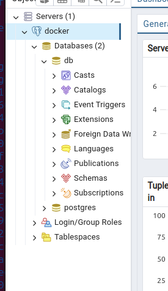
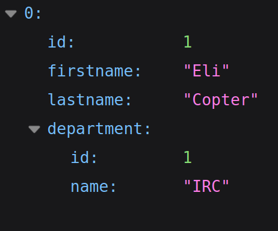

# TP 1 - Docker

## Database - Basics

### Construction de l'image Docker

```bash
docker build -t postgre .
[+] Building 12.9s (5/5) FINISHED                                docker:default
 => [internal] load build definition from dockerfile                       0.1s
 => => transferring dockerfile: 136B                                       0.0s
 => [internal] load metadata for docker.io/library/postgres:14.1-alpine    1.3s
 => [internal] load .dockerignore                                          0.0s
 => => transferring context: 2B                                            0.0s
 => [1/1] FROM docker.io/library/postgres:14.1-alpine@sha256:578ca5c8452  11.3s
...
 => => writing image sha256:6685d0c4833878dbaf36a3d7be0ba0cd1b87bd37dd22a  0.0s
 => => naming to docker.io/library/postgre                                 0.0s
```
### Démarrage du conteneur

```bash
docker run -d -p 5432:5432 --name postgre postgre
4baf7429645d1c6f077bcfddc2a1325d1f168df7a1d220970e7c9cdcdde023da
```

### Vérification du conteneur en cours d'exécution
```bash
docker ps
```
Assurez-vous que le conteneur est en cours d'exécution et que le port 5432 est correctement mappé.

### Connexion à la base de données



### Arrêt et suppression du conteneur PostgreSQL existant

```bash
docker stop postgre
postgre
docker rm postgre
postgre
```

### Création d'un network

```bash
docker network create app-network
d4779c4743c4ac50dbd7e0a9b278c8acbb960450e62c3215495229403cc22ac6
```

### Variable d'environement

```bash
docker run -d -p 5432:5432 --name postgre --network app-network -e POSTGRES_DB=db -e POSTGRES_USER=usr -e POSTGRES_PASSWORD=pwd postgre
```

### Remarque
Pourquoi devrions-nous exécuter le conteneur avec le drapeau -e pour fournir les variables d'environnement?

L'utilisation du drapeau -e nous permet de spécifier des variables d'environnement au moment du démarrage du conteneur. Cela offre une manière plus sécurisée de gérer les informations sensibles telles que les mots de passe, évitant ainsi de stocker des informations confidentielles en texte brut dans des fichiers.

## Database - Init Database

### Lancement de adminer

```bash
docker run -p "8090:8080" --net=app-network --name=adminer -d adminer
```

### Initialisation de la BDD
Ajout des scripts SQL nécessaires dans le répertoire du conteneur /docker-entrypoint-initdb.d.

```dockerfile
COPY init-scripts/*.sql /docker-entrypoint-initdb.d
```

## Backend API

Main.java
```java
public class Main {

    public static void main(String[] args) {
        System.out.println("Hello World!");
    }
 }
```

### Choix de l'image Docker Java

Utilisez l'image officielle OpenJDK pour Java 11 dans notre exemple.

```dockerfile
# Dockerfile
FROM openjdk:11

# Copier le fichier source Java dans le conteneur
COPY Main.java /app/Main.java

# Compiler le fichier Java
RUN javac /app/Main.java

# Commande à exécuter à la création du conteneur
CMD ["java", "-cp", "/app", "Main"]
```

### Construction de l'image Docker

```bash 
docker build -t java-hello-world .
```

### Exécution du conteneur

```bash
docker run java-hello-world
```
Affichage de "Hello World!"


## API

###  Projet Spring Boot

```scss
my-spring-boot-project
├── src
│   └── main
│       └── java
│           └── fr
│               └── takima
│                   └── training
│                       └── simpleapi
│                           ├── controller
│                           │   └── GreetingController.java
│                           └── SimpleApiApplication.java
├── target
│   └── ... (fichiers générés lors de la compilation)
├── Dockerfile
└── pom.xml
```

### Dockerfile

```dockerfile
# Build
FROM maven:3.8.6-amazoncorretto-17 AS myapp-build
ENV MYAPP_HOME /opt/myapp
WORKDIR $MYAPP_HOME
COPY pom.xml .
COPY src ./src
RUN mvn package -DskipTests

# Run
FROM amazoncorretto:17
ENV MYAPP_HOME /opt/myapp
WORKDIR $MYAPP_HOME
COPY --from=myapp-build $MYAPP_HOME/target/your-application-name.jar $MYAPP_HOME/myapp.jar

ENTRYPOINT java -jar myapp.jar
```

### Construire l'image Docker

```bash
docker build -t myapi .
```

#### Lancer le conteneur

```bash
docker run -d -p 8080:8080 --name myapi-container myapi
```
Vous pouvez maintenant tester l'API en utilisant curl ou tout autre outil similaire :

```bash
curl http://localhost:8080/
```

Cela devrait retourner quelque chose comme :

```bash
{"id":1,"content":"Hello, World!"}
```

#### Question
1-2 Why do we need a multistage build? And explain each step of this dockerfile.

Nous avons besoin d'une construction multi-étapes pour optimiser le processus de construction de notre application. Dans ce cas, le Dockerfile commence par utiliser une image Maven complète pour compiler le code source et récupérer les dépendances. Ensuite, il bascule vers une image plus légère contenant uniquement la JVM nécessaire pour exécuter l'application. Chaque étape est conçue pour une tâche spécifique : la première étape pour la compilation et la récupération des dépendances, et la seconde pour l'exécution de l'application.

## Backend API

### Configuration 

```yml
spring:
  jpa:
    properties:
      hibernate:
        jdbc:
          lob:
            non_contextual_creation: true
    generate-ddl: false
    open-in-view: true
  datasource:
    url: jdbc:postgresql://postgre:5432/db
    username: usr
    password: pwd
    driver-class-name: org.postgresql.Driver
management:
 server:
   add-application-context-header: false
 endpoints:
   web:
     exposure:
       include: health,info,env,metrics,beans,configprops
```

### Lacement

```bash
docker run -d -p 8080:8080 --name api-service --net=app-network myapi-bdd
```

### Requête

/departments/IRC/students



## Http server

### Index.html


### Reverse proxy

```conf
ServerName localhost

LoadModule proxy_module modules/mod_proxy.so
LoadModule proxy_http_module modules/mod_proxy_http.so

<VirtualHost *:80>
    ProxyPreserveHost On

    # Pour les requêtes vers /mon_api, redirigez vers le serveur HTTP
    ProxyPass /mon_api/ http://tp1_backend_1:8080/
    ProxyPassReverse /mon_api/ http://tp1_backend_1:8080/
</VirtualHost>
```

## Docker-compose

### Config

```yml
version: '3.7'

services:
    backend:
        build:
            context: ./Backend API/SpringApp/simpleapi BDD
        networks:
            - my-network
        depends_on:
            - database

    database:
        image: postgre
        environment:
            POSTGRES_DB: db
            POSTGRES_USER: usr
            POSTGRES_PASSWORD: pwd
        networks:
            - my-network

    httpd:
        build:
            context: ./Backend API/Http/Apache
        ports:
            - "8081:80"
        networks:
            - my-network
        depends_on:
            - backend

networks:
    my-network:
```

# TP 2 - Github Action

