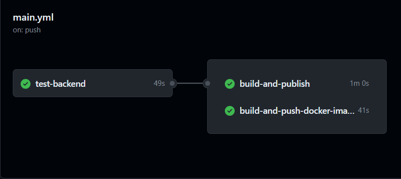

# TP 1 - Docker

## Database - Basics

### Construction de l'image Docker

```bash
docker build -t postgre .
[+] Building 12.9s (5/5) FINISHED                                docker:default
 => [internal] load build definition from dockerfile                       0.1s
 => => transferring dockerfile: 136B                                       0.0s
 => [internal] load metadata for docker.io/library/postgres:14.1-alpine    1.3s
 => [internal] load .dockerignore                                          0.0s
 => => transferring context: 2B                                            0.0s
 => [1/1] FROM docker.io/library/postgres:14.1-alpine@sha256:578ca5c8452  11.3s
...
 => => writing image sha256:6685d0c4833878dbaf36a3d7be0ba0cd1b87bd37dd22a  0.0s
 => => naming to docker.io/library/postgre                                 0.0s
```
### Démarrage du conteneur

```bash
docker run -d -p 5432:5432 --name postgre postgre
4baf7429645d1c6f077bcfddc2a1325d1f168df7a1d220970e7c9cdcdde023da
```

### Vérification du conteneur en cours d'exécution
```bash
docker ps
```
Assurez-vous que le conteneur est en cours d'exécution et que le port 5432 est correctement mappé.

### Connexion à la base de données


### Arrêt et suppression du conteneur PostgreSQL existant

```bash
docker stop postgre
postgre
docker rm postgre
postgre
```

### Création d'un network

```bash
docker network create app-network
d4779c4743c4ac50dbd7e0a9b278c8acbb960450e62c3215495229403cc22ac6
```

### Variable d'environement

```bash
docker run -d -p 5432:5432 --name postgre --network app-network -e POSTGRES_DB=db -e POSTGRES_USER=usr -e POSTGRES_PASSWORD=pwd postgre
```

### Remarque
Pourquoi devrions-nous exécuter le conteneur avec le drapeau -e pour fournir les variables d'environnement?

L'utilisation du drapeau -e nous permet de spécifier des variables d'environnement au moment du démarrage du conteneur. Cela offre une manière plus sécurisée de gérer les informations sensibles telles que les mots de passe, évitant ainsi de stocker des informations confidentielles en texte brut dans des fichiers.

## Database - Init Database

### Lancement de adminer

```bash
docker run -p "8090:8080" --net=app-network --name=adminer -d adminer
```

### Initialisation de la BDD
Ajout des scripts SQL nécessaires dans le répertoire du conteneur /docker-entrypoint-initdb.d.

```dockerfile
COPY init-scripts/*.sql /docker-entrypoint-initdb.d
```

## Backend API

Main.java
```java
public class Main {

    public static void main(String[] args) {
        System.out.println("Hello World!");
    }
 }
```

### Choix de l'image Docker Java

Utilisez l'image officielle OpenJDK pour Java 11 dans notre exemple.

```dockerfile
# Dockerfile
FROM openjdk:11

# Copier le fichier source Java dans le conteneur
COPY Main.java /app/Main.java

# Compiler le fichier Java
RUN javac /app/Main.java

# Commande à exécuter à la création du conteneur
CMD ["java", "-cp", "/app", "Main"]
```

### Construction de l'image Docker

```bash 
docker build -t java-hello-world .
```

### Exécution du conteneur

```bash
docker run java-hello-world
```
Affichage de "Hello World!"


## API

###  Projet Spring Boot

```scss
my-spring-boot-project
├── src
│   └── main
│       └── java
│           └── fr
│               └── takima
│                   └── training
│                       └── simpleapi
│                           ├── controller
│                           │   └── GreetingController.java
│                           └── SimpleApiApplication.java
├── target
│   └── ... (fichiers générés lors de la compilation)
├── Dockerfile
└── pom.xml
```

### Dockerfile

```dockerfile
# Build
FROM maven:3.8.6-amazoncorretto-17 AS myapp-build
ENV MYAPP_HOME /opt/myapp
WORKDIR $MYAPP_HOME
COPY pom.xml .
COPY src ./src
RUN mvn package -DskipTests

# Run
FROM amazoncorretto:17
ENV MYAPP_HOME /opt/myapp
WORKDIR $MYAPP_HOME
COPY --from=myapp-build $MYAPP_HOME/target/your-application-name.jar $MYAPP_HOME/myapp.jar

ENTRYPOINT java -jar myapp.jar
```

### Construire l'image Docker

```bash
docker build -t myapi .
```

#### Lancer le conteneur

```bash
docker run -d -p 8080:8080 --name myapi-container myapi
```
Vous pouvez maintenant tester l'API en utilisant curl ou tout autre outil similaire :

```bash
curl http://localhost:8080/
```

Cela devrait retourner quelque chose comme :

```bash
{"id":1,"content":"Hello, World!"}
```

#### Question
1-2 Why do we need a multistage build? And explain each step of this dockerfile.

Nous avons besoin d'une construction multi-étapes pour optimiser le processus de construction de notre application. Dans ce cas, le Dockerfile commence par utiliser une image Maven complète pour compiler le code source et récupérer les dépendances. Ensuite, il bascule vers une image plus légère contenant uniquement la JVM nécessaire pour exécuter l'application. Chaque étape est conçue pour une tâche spécifique : la première étape pour la compilation et la récupération des dépendances, et la seconde pour l'exécution de l'application.

## Backend API

### Configuration 

```yml
spring:
  jpa:
    properties:
      hibernate:
        jdbc:
          lob:
            non_contextual_creation: true
    generate-ddl: false
    open-in-view: true
  datasource:
    url: jdbc:postgresql://postgre:5432/db
    username: usr
    password: pwd
    driver-class-name: org.postgresql.Driver
management:
 server:
   add-application-context-header: false
 endpoints:
   web:
     exposure:
       include: health,info,env,metrics,beans,configprops
```

### Lacement

```bash
docker run -d -p 8080:8080 --name api-service --net=app-network myapi-bdd
```

### Requête

/departments/IRC/students


## Http server

### Index.html


### Reverse proxy

```conf
ServerName localhost

LoadModule proxy_module modules/mod_proxy.so
LoadModule proxy_http_module modules/mod_proxy_http.so

<VirtualHost *:80>
    ProxyPreserveHost On

    # Pour les requêtes vers /mon_api, redirigez vers le serveur HTTP
    ProxyPass /mon_api/ http://tp1_backend_1:8080/
    ProxyPassReverse /mon_api/ http://tp1_backend_1:8080/
</VirtualHost>
```

## Docker-compose

### Config

```yml
version: '3.7'

services:
    backend:
        build:
            context: ./Backend API/SpringApp/simpleapi BDD
        networks:
            - my-network
        depends_on:
            - database

    database:
        image: postgre
        environment:
            POSTGRES_DB: db
            POSTGRES_USER: usr
            POSTGRES_PASSWORD: pwd
        networks:
            - my-network

    httpd:
        build:
            context: ./Backend API/Http/Apache
        ports:
            - "8081:80"
        networks:
            - my-network
        depends_on:
            - backend

networks:
    my-network:
```

# TP 2 - Github Action

### Git : https://github.com/Tiblouk/DevOps

### Question
#### What are testcontainers?

Testcontainers est une bibliothèque Java qui fournit des instances légères et temporaires. Ils permettent aux développeurs de créer facilement des environnements conteneurisés pour les tests sans avoir besoin de processus de configuration ou de nettoyage complexes. Les testcontainers sont particulièrement utiles pour les tests d'intégration, où vous devez interagir avec des dépendances externes telles que des bases de données ou des services externes.

## Workflow

```yml
# Définition du nom du workflow
name: CI devops 2023

# Événements déclencheurs du workflow
on:
  push:
    branches: main
  pull_request:

# Définition des jobs à exécuter dans le workflow
jobs:
  test-backend: 
    # Spécification de l'environnement d'exécution
    runs-on: ubuntu-22.04
    steps:
      # Étape pour récupérer le code depuis le dépôt GitHub
      - name: Checkout code
        uses: actions/checkout@v2.5.0

      # Étape pour configurer JDK 17
      - name: Set up JDK 17
        uses: actions/setup-java@v2
        with:
          java-version: '17'
          distribution: 'adopt'
          
      # Étape pour construire et tester avec Maven
      - name: Build and test with Maven
        run: mvn clean verify --file "TP_1/Backend_API/SpringApp/simpleapi_BDD/pom.xml"
```

## Workflow Build and publish 
```yml
# Définition du nom du workflow
name: CI devops 2023

# Événements déclencheurs du workflow
on:
  push:
    branches: main
  pull_request:

# Définition des jobs à exécuter dans le workflow
jobs:
  # Job pour tester le backend
  test-backend: 
    # Spécification de l'environnement d'exécution
    runs-on: ubuntu-22.04
    steps:
      # Étape pour récupérer le code depuis le dépôt GitHub
      - name: Checkout code
        uses: actions/checkout@v2.5.0
  
      # Étape pour configurer JDK 17
      - name: Set up JDK 17
        uses: actions/setup-java@v2
        with:
          java-version: '17'
          distribution: 'adopt'
          
      # Étape pour construire et tester avec Maven
      - name: Build and test with Maven
        run: mvn clean verify --file "TP_1/Backend_API/SpringApp/simpleapi_BDD/pom.xml"
        
  # Job pour construire et publier l'image Docker
  build-and-push-docker-image:
    # Dépend du job 'test-backend'
    needs: test-backend
    # Exécuter uniquement lorsque le code est compilé et les tests réussissent
    runs-on: ubuntu-22.04

    # Étapes à effectuer dans le job
    steps:
      # Étape pour récupérer le code depuis le dépôt GitHub
      - name: Checkout code
        uses: actions/checkout@v2.5.0

      # Étape pour construire et pousser l'image backend
      - name: Build image and push backend
        uses: docker/build-push-action@v3
        with:
          # Chemin relatif vers l'emplacement où se trouve le code source avec le Dockerfile
          context: ./TP_1/Backend_API/SpringApp/simpleapi_BDD
          # Remarque : les étiquettes doivent être en minuscules
          tags: ${{secrets.DOCKERHUB_USERNAME}}/tp-devops-simple-api:latest

       # Étape pour construire et pousser l'image de la base de données
      - name: Build image and push database
        uses: docker/build-push-action@v3
        with:
          context: ./TP_1/POST_GRE
          tags: ${{secrets.DOCKERHUB_USERNAME}}/tp-devops-database:latest
      
      # Étape pour construire et pousser l'image httpd
      - name: Build image and push httpd
        uses: docker/build-push-action@v3
        with:
          context: ./TP_1/Backend_API/Http/Apache
          tags: ${{secrets.DOCKERHUB_USERNAME}}/tp-devops-httpd:latest
   # Job pour construire et publier les images Docker lorsqu'il y a un commit sur la branche principale
  build-and-publish:
    needs: test-backend
    runs-on: ubuntu-22.04

    steps:
      - name: Checkout code
        uses: actions/checkout@v2.5.0

      - name: Set up Docker Buildx
        uses: docker/setup-buildx-action@v1

      - name: Login to DockerHub
        uses: docker/login-action@v1
        with:
          username: ${{ secrets.DOCKERHUB_USERNAME }}
          password: ${{ secrets.DOCKERHUB_PASSWORD }}

      - name: Build and push backend image
        uses: docker/build-push-action@v3
        with:
          context: ./TP_1/Backend_API/SpringApp/simpleapi_BDD
          tags: ${{ secrets.DOCKERHUB_USERNAME }}/tp-devops-simple-api:latest
          push: ${{ github.ref == 'refs/heads/main' }}  # Pousse l'image seulement si le commit est sur la branche main

      - name: Build and push postgres image
        uses: docker/build-push-action@v3
        with:
          context: ./TP_1/POST_GRE
          tags: ${{ secrets.DOCKERHUB_USERNAME }}/tp-devops-postgres:latest
          push: ${{ github.ref == 'refs/heads/main' }}  

      - name: Build and push httpd image
        uses: docker/build-push-action@v3
        with:
          context: ./TP_1/Backend_API/Http/Apache
          tags: ${{ secrets.DOCKERHUB_USERNAME }}/tp-devops-httpd:latest
          push: ${{ github.ref == 'refs/heads/main' }}  # Pousse l'image seulement si le commit est sur la branche main  
```


# TP 3 - Ansible

## Installation et connexion

Commande pour installer ansible
```bash
sudo apt install ansible
```

Commande pour lire la clef ssh
```bash
chmod 400 ./TP_3/id_rsa
```

Commande pour ce connecter en SSH
```bash
ssh -i ./id_rsa centos@yamine.kebaili.takima.cloud
```

## Ping

Création du fichier de configuration '/etc/ansible/hosts'
```bash
sudo mkdir /etc/ansible
sudo touch /etc/ansible/hosts

[servers]
yamine.kebaili.takima.cloud ansible_user=centos ansible_ssh_private_key_file=/home/tiblouk/Bureau/dossier/DevOps/TP_3/id_rsa

```


Clef SSH n'est pas suffisament protéger :
```bash
sudo ansible all -m ping
yamine.kebaili.takima.cloud | UNREACHABLE! => {
    "changed": false,
    "msg": "Failed to connect to the host via ssh: Warning: Permanently added 'yamine.kebaili.takima.cloud' (ED25519) to the list of known hosts.\r\n@@@@@@@@@@@@@@@@@@@@@@@@@@@@@@@@@@@@@@@@@@@@@@@@@@@@@@@@@@@\r\n@         WARNING: UNPROTECTED PRIVATE KEY FILE!          @\r\n@@@@@@@@@@@@@@@@@@@@@@@@@@@@@@@@@@@@@@@@@@@@@@@@@@@@@@@@@@@\r\nPermissions 0555 for '/home/tiblouk/Bureau/dossier/DevOps/TP_3/id_rsa' are too open.\r\nIt is required that your private key files are NOT accessible by others.\r\nThis private key will be ignored.\r\nLoad key \"/home/tiblouk/Bureau/dossier/DevOps/TP_3/id_rsa\": bad permissions\r\ncentos@yamine.kebaili.takima.cloud: Permission denied (publickey,gssapi-keyex,gssapi-with-mic).",
    "unreachable": true
}
```

Changement de droit :

```
sudo chmod 600 /home/tiblouk/Bureau/dossier/DevOps/TP_3/id_rsa
```
Success :
```bash
ansible all -m ping
yamine.kebaili.takima.cloud | SUCCESS => {
    "ansible_facts": {
        "discovered_interpreter_python": "/usr/bin/python"
    },
    "changed": false,
    "ping": "pong"
}
```

## Httpd
Pour installer Apache :

```bash
ansible all -m yum -a "name=httpd state=present" -u centos --become
yamine.kebaili.takima.cloud | CHANGED => {
    "ansible_facts": {
        "discovered_interpreter_python": "/usr/bin/python"
    },
    "changed": true,
    "changes": {
        "installed": [
            "httpd"
        ]
    },
    "msg": "",
    "rc": 0,
    "results": [
        "Loaded plugins: fastestmirror\nLoading mirror speeds from cached hostfile\n * base: download.cf.centos.org\n * extras: download.cf.centos.org\n * updates: download.cf.centos.org\nResolving Dependencies\n--> Running transaction check\n---> Package httpd.x86_64 0:2.4.6-99.el7.centos.1 will be installed\n--> Processing Dependency: httpd-tools = 2.4.6-99.el7.centos.1 for package: httpd-2.4.6-99.el7.centos.1.x86_64\n--> Processing Dependency: system-logos >= 7.92.1-1 for package: httpd-2.4.6-99.el7.centos.1.x86_64\n--> Processing Dependency: /etc/mime.types for package: httpd-2.4.6-99.el7.centos.1.x86_64\n--> Processing Dependency: libaprutil-1.so.0()(64bit) for package: httpd-2.4.6-99.el7.centos.1.x86_64\n--> Processing Dependency: libapr-1.so.0()(64bit) for package: httpd-2.4.6-99.el7.centos.1.x86_64\n--> Running transaction check\n---> Package apr.x86_64 0:1.4.8-7.el7 will be installed\n---> Package apr-util.x86_64 0:1.5.2-6.el7_9.1 will be installed\n---> Package centos-logos.noarch 0:70.0.6-3.el7.centos will be installed\n---> Package httpd-tools.x86_64 0:2.4.6-99.el7.centos.1 will be installed\n---> Package mailcap.noarch 0:2.1.41-2.el7 will be installed\n--> Finished Dependency Resolution\n\nDependencies Resolved\n\n================================================================================\n Package           Arch        Version                       Repository    Size\n================================================================================\nInstalling:\n httpd             x86_64      2.4.6-99.el7.centos.1         updates      2.7 M\nInstalling for dependencies:\n apr               x86_64      1.4.8-7.el7                   base         104 k\n apr-util          x86_64      1.5.2-6.el7_9.1               updates       92 k\n centos-logos      noarch      70.0.6-3.el7.centos           base          21 M\n httpd-tools       x86_64      2.4.6-99.el7.centos.1         updates       94 k\n mailcap           noarch      2.1.41-2.el7                  base          31 k\n\nTransaction Summary\n================================================================================\nInstall  1 Package (+5 Dependent packages)\n\nTotal download size: 24 M\nInstalled size: 32 M\nDownloading packages:\n--------------------------------------------------------------------------------\nTotal                                               29 MB/s |  24 MB  00:00     \nRunning transaction check\nRunning transaction test\nTransaction test succeeded\nRunning transaction\n  Installing : apr-1.4.8-7.el7.x86_64                                       1/6 \n  Installing : apr-util-1.5.2-6.el7_9.1.x86_64                              2/6 \n  Installing : httpd-tools-2.4.6-99.el7.centos.1.x86_64                     3/6 \n  Installing : centos-logos-70.0.6-3.el7.centos.noarch                      4/6 \n  Installing : mailcap-2.1.41-2.el7.noarch                                  5/6 \n  Installing : httpd-2.4.6-99.el7.centos.1.x86_64                           6/6 \n  Verifying  : httpd-tools-2.4.6-99.el7.centos.1.x86_64                     1/6 \n  Verifying  : mailcap-2.1.41-2.el7.noarch                                  2/6 \n  Verifying  : apr-1.4.8-7.el7.x86_64                                       3/6 \n  Verifying  : httpd-2.4.6-99.el7.centos.1.x86_64                           4/6 \n  Verifying  : apr-util-1.5.2-6.el7_9.1.x86_64                              5/6 \n  Verifying  : centos-logos-70.0.6-3.el7.centos.noarch                      6/6 \n\nInstalled:\n  httpd.x86_64 0:2.4.6-99.el7.centos.1                                          \n\nDependency Installed:\n  apr.x86_64 0:1.4.8-7.el7                                                      \n  apr-util.x86_64 0:1.5.2-6.el7_9.1                                             \n  centos-logos.noarch 0:70.0.6-3.el7.centos                                     \n  httpd-tools.x86_64 0:2.4.6-99.el7.centos.1                                    \n  mailcap.noarch 0:2.1.41-2.el7                                                 \n\nComplete!\n"
    ]
}
```

Ensuite, pour créer la page HTML "Hello World" :

```bash
ansible all -m shell -a 'echo "<html><h1>Hello World</h1></html>" >> /var/www/html/index.html' -u centos --become

yamine.kebaili.takima.cloud | CHANGED | rc=0 >>
```
Démarrer le service Apache avec la commande suivante 

```bash
ansible all -m service -a "name=httpd state=started" -u centos --become 
yamine.kebaili.takima.cloud | CHANGED => {
    "ansible_facts": {
        "discovered_interpreter_python": "/usr/bin/python"
    },
    "changed": true,
    "name": "httpd",
...
```

Mettre la page index créer dans le tp1 :
```bash
ansible all -m copy -a "src=/home/tiblouk/Bureau/dossier/DevOps/TP_1/Backend_API/Http/Apache/index.html dest=/var/www/html/index.html" -u centos --become
```


## Inventories
Inventory :
```bash
all:
  vars:
    ansible_user: centos
    ansible_ssh_private_key_file: /home/tiblouk/Bureau/dossier/DevOps/TP_3/id_rsa
  children:
    prod:
      hosts: yamine.kebaili.takima.cloud
```
Test de l'inventory :
```bash
ansible all -i ansible/inventories/setup.yml -m ping
[WARNING]: Unable to parse /home/tiblouk/Bureau/dossier/DevOps/ansible/inventories/setup.yml as an inventory source
[WARNING]: No inventory was parsed, only implicit localhost is available
[WARNING]: provided hosts list is empty, only localhost is available. Note that the implicit localhost does not match 'all'
```

## Facts

On obtient les informations sur la distribution

```bash
ansible all -i inventories/setup.yml -m setup -a "filter=ansible_distribution*"

yamine.kebaili.takima.cloud | SUCCESS => {
    "ansible_facts": {
        "ansible_distribution": "CentOS",
        "ansible_distribution_file_parsed": true,
        "ansible_distribution_file_path": "/etc/redhat-release",
        "ansible_distribution_file_variety": "RedHat",
        "ansible_distribution_major_version": "7",
        "ansible_distribution_release": "Core",
        "ansible_distribution_version": "7.9",
        "discovered_interpreter_python": "/usr/bin/python"
    },
    "changed": false
}
```
Suppression du serveur Apache :
```bash
ansible all -i inventories/setup.yml -m yum -a "name=httpd state=absent" --become

yamine.kebaili.takima.cloud | CHANGED => {
    "ansible_facts": {
        "discovered_interpreter_python": "/usr/bin/python"
    },
    "changed": true,
    "changes": {
        "removed": [
            "httpd"
        ]
    },
    "msg": "",
    "rc": 0,
    "results": [
        "Modules complémentaires chargés : fastestmirror\nRésolution des dépendances\n--> Lancement de la transaction de test\n---> Le paquet httpd.x86_64 0:2.4.6-99.el7.centos.1 sera effacé\n--> Résolution des dépendances terminée\n\nDépendances résolues\n\n================================================================================\n Package      Architecture  Version                       Dépôt           Taille\n================================================================================\nSuppression :\n httpd        x86_64        2.4.6-99.el7.centos.1         @updates        9.4 M\n\nRésumé de la transaction\n================================================================================\nSupprimer  1 Paquet\n\nTaille d'installation : 9.4 M\nDownloading packages:\nRunning transaction check\nRunning transaction test\nTransaction test succeeded\nRunning transaction\n  Suppression  : httpd-2.4.6-99.el7.centos.1.x86_64                         1/1 \n  Vérification : httpd-2.4.6-99.el7.centos.1.x86_64                         1/1 \n\nSupprimé :\n  httpd.x86_64 0:2.4.6-99.el7.centos.1                                          \n\nTerminé !\n"
    ]
}
```

Doccumentation de l'inventory :
```yml
# Inventaire Ansible

# Section 'all' représentant tous les hôtes
all:
  # Variables applicables à tous les hôtes de la section 'all'
  vars:
    # Utilisateur SSH à utiliser pour la connexion
    ansible_user: centos
    # Chemin absolu vers la clé privée SSH pour l'authentification
    ansible_ssh_private_key_file: /home/tiblouk/Bureau/dossier/DevOps/TP_3/id_rsa

  # Groupes d'hôtes pour une meilleure organisation
  children:
    # Groupe 'prod' contenant des hôtes de production
    prod:
      # Liste des hôtes de production
      hosts: yamine.kebaili.takima.cloud
```

## Playbooks

Premier playbook :
```yml
- hosts: all
  gather_facts: false
  become: true

  tasks:
   - name: Test connection
     ping:
```

Execution :
```bash
ansible-playbook -i inventories/setup.yml playbook.yml

PLAY [all] ****************************************************************************************************************************************************************************

TASK [Test connection] ****************************************************************************************************************************************************************
ok: [yamine.kebaili.takima.cloud]

PLAY RECAP ****************************************************************************************************************************************************************************
yamine.kebaili.takima.cloud : ok=1    changed=0    unreachable=0    failed=0    skipped=0    rescued=0    ignored=0   
```

Test du book avec une erreur

```bash
ansible-playbook -i inventories/setup.yml playbook.yml --syntax-check
ERROR! conflicting action statements: nae, ping

The error appears to be in '/home/tiblouk/Bureau/dossier/DevOps/TP_3/ansible/playbook.yml': line 6, column 6, but may
be elsewhere in the file depending on the exact syntax problem.

The offending line appears to be:

  tasks:
   - nae: Test connection
     ^ here
```


Test du playbook sans erreur :
```bash
ensible-playbook -i inventories/setup.yml playbook.yml --syntax-check

playbook: playbook.yml
```

### Advanced playbook

Le ansible utilisé :

```yml
# Playbook Ansible pour installer Docker

# Définition des hôtes cibles, collecte des faits désactivée, exécution en tant que super utilisateur
- hosts: all
  gather_facts: false
  become: true

  # Tâches pour installer Docker
  tasks:

    # Installation de device-mapper-persistent-data
    - name: Install device-mapper-persistent-data
      yum:
        name: device-mapper-persistent-data
        state: latest

    # Installation de lvm2
    - name: Install lvm2
      yum:
        name: lvm2
        state: latest

    # Ajout du dépôt Docker
    - name: Add Docker repository
      command: sudo yum-config-manager --add-repo=https://download.docker.com/linux/centos/docker-ce.repo

    # Installation de Docker
    - name: Install Docker
      yum:
        name: docker-ce
        state: present

    # Installation de Python 3
    - name: Install python3
      yum:
        name: python3
        state: present

    # Installation de docker avec Python 3
    - name: Install docker with Python 3
      pip:
        name: docker
        executable: pip3
      vars:
        ansible_python_interpreter: /usr/bin/python3

    # Vérification que Docker est en cours d'exécution
    - name: Make sure Docker is running
      service: name=docker state=started
      tags: docker
```

L'exécution :
```yml
ansible-playbook -i inventories/setup.yml playbook.yml

PLAY [all] ****************************************************************************************************************************************************************************

TASK [Install device-mapper-persistent-data] ******************************************************************************************************************************************
changed: [yamine.kebaili.takima.cloud]

TASK [Install lvm2] *******************************************************************************************************************************************************************
changed: [yamine.kebaili.takima.cloud]

TASK [Add Docker repository] **********************************************************************************************************************************************************
changed: [yamine.kebaili.takima.cloud]

TASK [Install Docker] *****************************************************************************************************************************************************************
changed: [yamine.kebaili.takima.cloud]

TASK [Install python3] ****************************************************************************************************************************************************************
changed: [yamine.kebaili.takima.cloud]

TASK [Install docker with Python 3] ***************************************************************************************************************************************************
changed: [yamine.kebaili.takima.cloud]

TASK [Make sure Docker is running] ****************************************************************************************************************************************************
changed: [yamine.kebaili.takima.cloud]

PLAY RECAP ****************************************************************************************************************************************************************************
yamine.kebaili.takima.cloud : ok=7    changed=7    unreachable=0    failed=0    skipped=0    rescued=0    ignored=0   
```

### Using roles

Création du role docker

```bash
ansible-galaxy init roles/docker
- Role roles/docker was created successfully
```

Main.yml :

```bash
# Tâches pour installer Docker

# Installation de device-mapper-persistent-data
- name: Install device-mapper-persistent-data
  yum:
    name: device-mapper-persistent-data
    state: latest

# Installation de lvm2
- name: Install lvm2
  yum:
    name: lvm2
    state: latest

# Ajout du dépôt Docker
- name: Add Docker repository
  command: sudo yum-config-manager --add-repo=https://download.docker.com/linux/centos/docker-ce.repo

# Installation de Docker
- name: Install Docker
  yum:
    name: docker-ce
    state: present

# Installation de Python 3
- name: Install python3
  yum:
    name: python3
    state: present

# Installation de docker avec Python 3
- name: Install docker with Python 3
  pip:
    name: docker
    executable: pip3
  vars:
    ansible_python_interpreter: /usr/bin/python3

# Vérification que Docker est en cours d'exécution
- name: Make sure Docker is running
  service: name=docker state=started
  tags: docker
```

